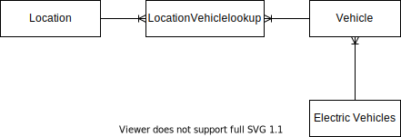

# Electric Vehicle Data Modelling

On this project I am showcasing how to get data from postgres using spark and how to load spark dataframe into spark.  

There are a few steps to get the environement setup.  

# Conceptial Data Model

A vehical can be in many different zipcodes and one zipcode can have many vechicle.   Therefore a lookup table is necessary to handle this relationship.  

manny vehicles can have many electric types.

